# Lab5Web
Praktikum5

# JavaScript
## Membuat Dokumen HTML JavaScript
Ini adalah tampilannya
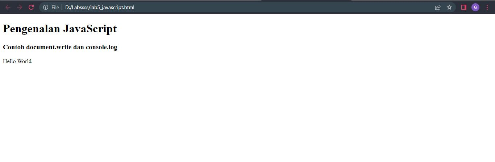
## Pemakaian Alert Sebagai Property Window
Ini adalah tampilannya
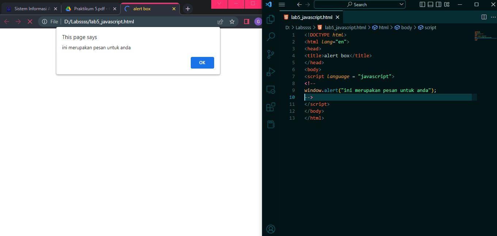
## Pemakaian Method Dalam Objek
Ini adalah tampilannya
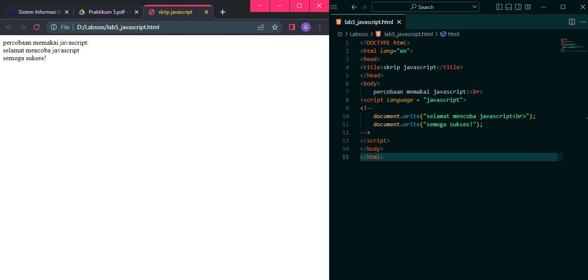
## Pemakaian Prompt
Ini adalah tampilannya

## Pembuatan Fungsi dan Cara Pemanggilannya
Ini adalah tampilannya
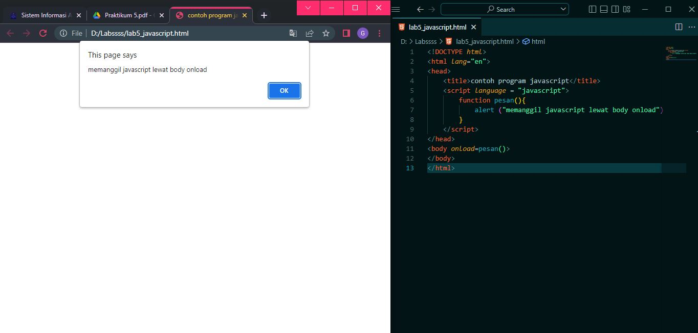
## Operasi Dasar Arimatika JavaScript
Ini adalah tampilannya
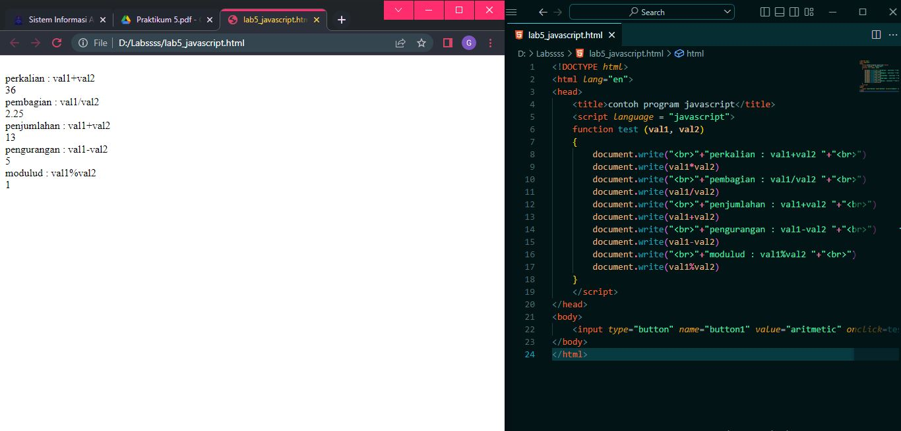
## Seleksi Kondisi (if..else)
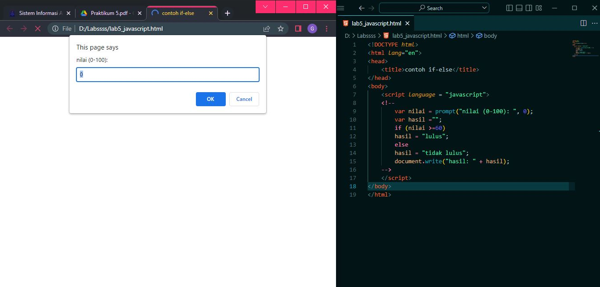
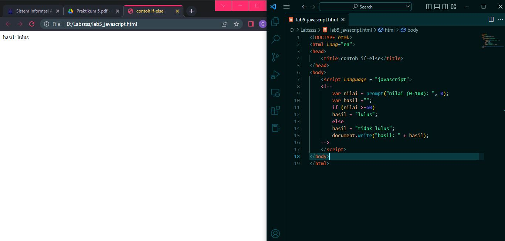
## Penggunaan Operator Switch untuk Seleksi Kondisi
Ini adalah tampilannya
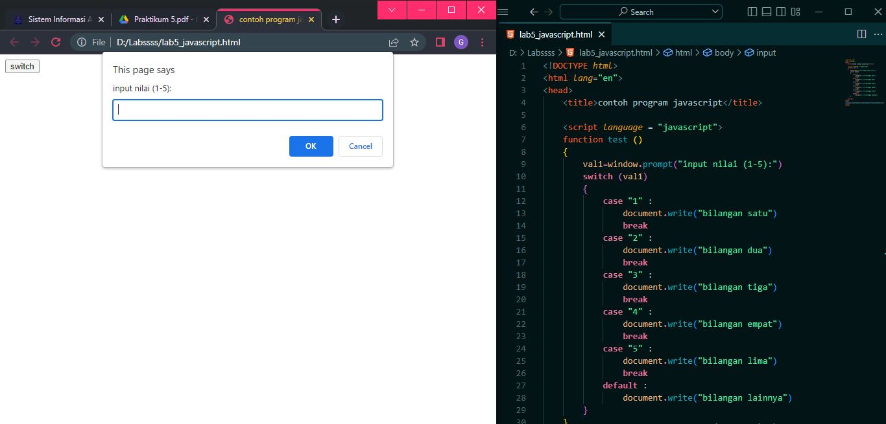
## Pembuatan Form Input
Ini adalah tampilannya
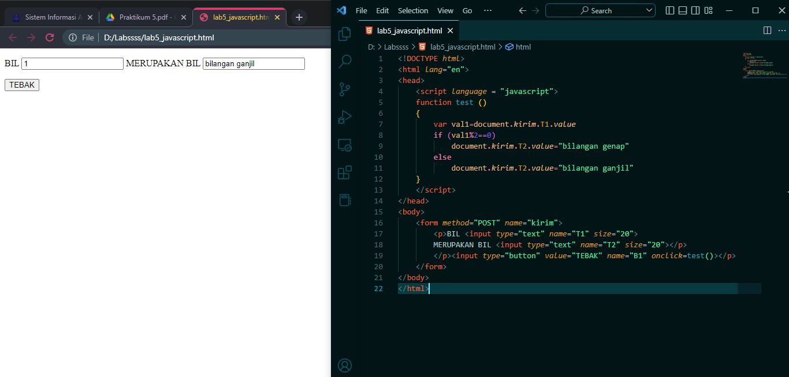
## Pembuatan Form Button
Ini adalah tampilannya
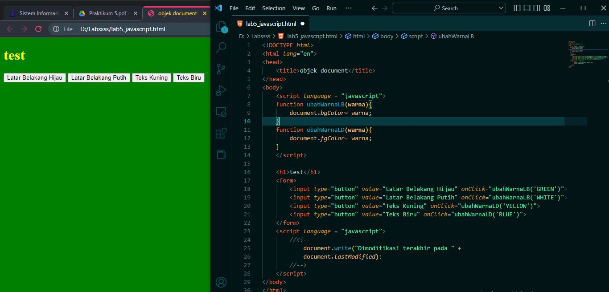
## HTML DOM
Pilihan menggunakan checkBox dengan perhitungan otomatis 
Ini adalah tampilannya
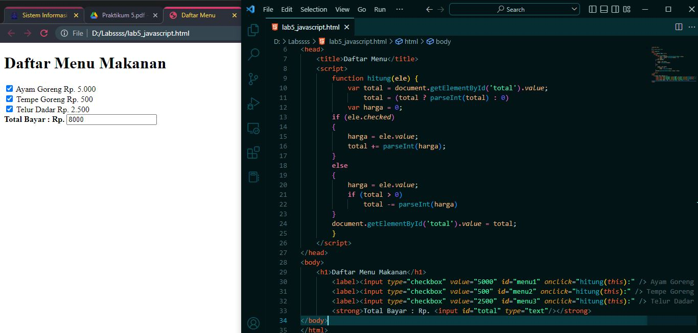